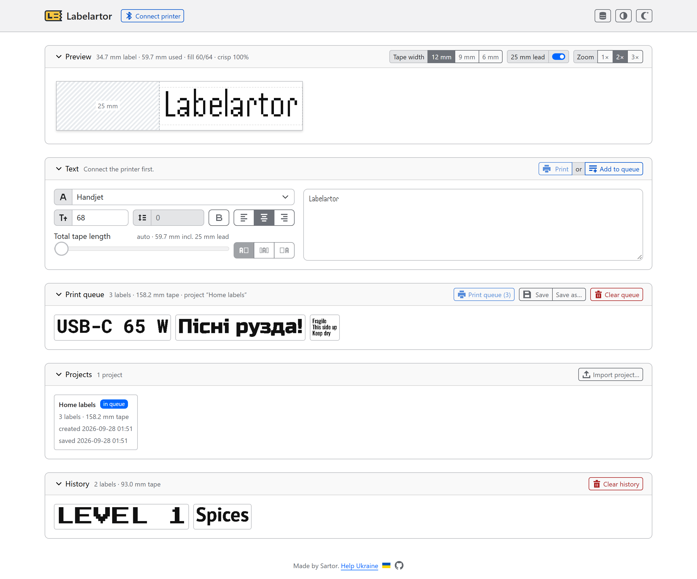
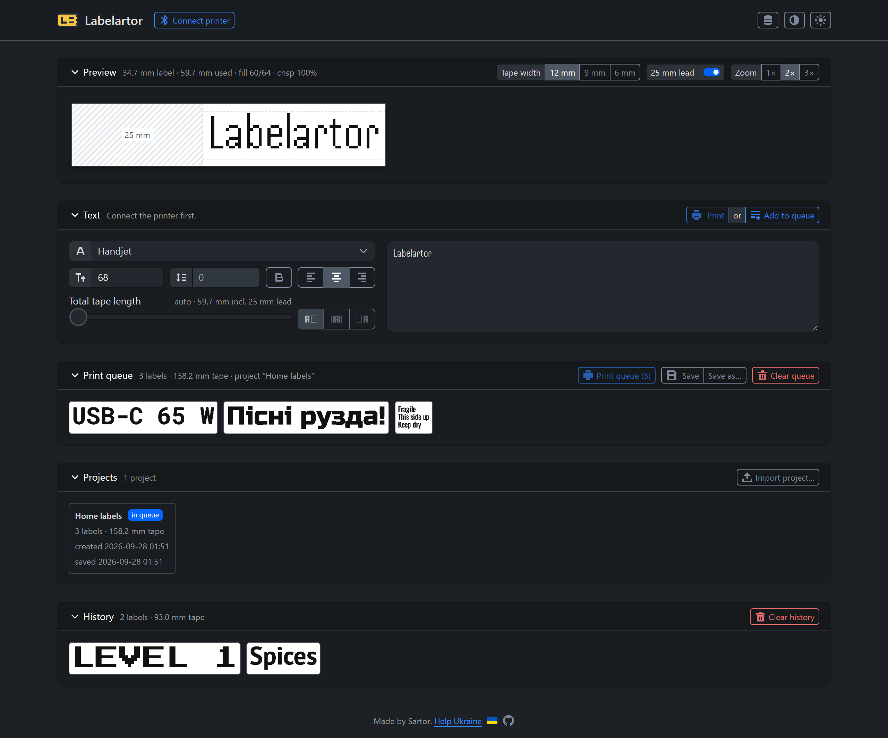

# Labelartor

**Live:** <https://sartor.github.io/labelartor/>

Design and print labels on the **Brother PT-P300BT** from the browser. The app talks to the
printer over **Web Serial** (Bluetooth Classic SPP): no drivers, no backend, nothing leaves
the browser.

<p align="center">
  
  
</p>

## Features

- Text labels of one or more lines: font, bold (only fonts with a real bold face), size
  (auto fills the tape), line gap, left / centre / right alignment.
- 30 bundled fonts in sans, condensed, mono and pixel groups.
- Preview at real size (1×, 2× or 3×), with crispness score for pixel perfect prints.
- Print queue: collect labels and print them as one batch.
- History of printed labels, projects (named snapshots of the queue) and a JSON backup of
  everything. All of it lives in localStorage

## Requirements

- **Browser:** Chrome, Edge 117+m Firefox 156 (with WebSerial on) on desktop, or Chrome on Android (Web Serial)
- **Printer:** paired with the computer in the OS Bluetooth settings.
- **Tooling:** [Bun](https://bun.sh) 1.4+. Vue 3 · Vite · Pinia · [Halfmoon 2](https://www.gethalfmoon.com)

## Scripts

```bash
bun install        # install dependencies
bun run dev        # dev server on http://localhost:5173
bun run build      # type-check + production build into dist/
bun run preview    # serve the production build
bun test           # unit tests (protocol, raster, layout, icons)
bun run type-check # vue-tsc (see scripts/vue-tsc-bun.cjs)
bun run lint       # ESLint (auto-fix)
bun run lint:check # ESLint + Prettier check, as in CI
bun run format     # Prettier
```

Web Serial needs a secure context: `localhost` or HTTPS.

## License

[MIT](LICENSE). The bundled fonts keep their own licenses (SIL OFL, Apache 2.0, or the
GNU font-embedding exception for Unifont).

## Credits

The printer protocol layer was re-implemented from the JavaScript port in
[Ircama/PT-P300BT](https://github.com/Ircama/PT-P300BT) (`web/printer.js`). That port is
based on the work in gists by [stecman](https://gist.github.com/stecman/ee1fd9a8b1b6f0fdd170ee87ba2ddafd),
[dogtopus](https://gist.github.com/dogtopus/64ae743825e42f2bb8ec79cea7ad2057) and
[vsigler](https://gist.github.com/vsigler/98eafaf8cdf2374669e590328164f5fc).